# 🛍️ Retail Sales & Customer Analytics

> A full-stack data analytics project combining **SQL**, **Python**, and **Power BI** to extract actionable insights from retail customer data.

---

## 📌 Project Overview

This end-to-end analytics project analyzes customer shopping behavior using a dataset of **3,900 retail transactions**. The goal was to uncover patterns in revenue, customer loyalty, product performance, and demographic spending — and communicate those findings through an interactive Power BI dashboard.

This project demonstrates the complete analyst workflow:

- **Data cleaning & feature engineering** in Python (Jupyter Notebook)
- **Business question answering** via SQL queries
- **Visual storytelling** through a Power BI dashboard

---

## 🗂️ Repository Structure

```
customer-behavior-analysis/
│
├── data/
│   └── shopping_trends.csv                          # Raw dataset
│
├── notebooks/
│   └── customer_shopping_behavior_analysis.ipynb    # Python pipeline
│
├── sql/
│   └── queries.sql                                 # All 10 business SQL queries
│   └── answers   
├── dashboard/
│   ├── customer-behavior-showcase.pbix              # Power BI dashboard file
│   └── screenshot-dashboard.png                     # Dashboard preview
│
└── README.md
```

---

## 📊 Dataset

**Source:** [](https://www.kaggle.com/datasets/iamsouravbanerjee/customer-shopping-trends-dataset)  
**Records:** 3,900 customers  
**File:** `shopping_trends.csv`

| Column | Description |
|---|---|
| `Customer ID` | Unique customer identifier |
| `Age` | Customer age |
| `Gender` | Male / Female |
| `Item Purchased` | Product name |
| `Category` | Clothing, Footwear, Accessories, Outerwear |
| `Purchase Amount (USD)` | Transaction value |
| `Location` | US state |
| `Season` | Season of purchase |
| `Review Rating` | Rating out of 5 |
| `Subscription Status` | Whether customer is subscribed |
| `Shipping Type` | Shipping method used |
| `Discount Applied` | Whether a discount was used |
| `Previous Purchases` | Count of past purchases |
| `Payment Method` | Payment mode |
| `Frequency of Purchases` | Purchase frequency |

---

## 🐍 Python – Data Cleaning, Feature Engineering & Pipeline

**Notebook:** `notebooks/customer_shopping_behavior_analysis.ipynb`

The notebook handles the full data preparation pipeline before SQL analysis — transforming raw CSV data into a clean, analysis-ready MySQL table.

**1. Load & Inspect**
- Loaded the raw CSV using `pandas`
- Inspected structure with `df.head()`, `df.info()`, and `df.describe(include='all')`
- Identified 37 missing values in the `Review Rating` column

**2. Handle Missing Values**
- Imputed missing `Review Rating` values using **category-level median** (grouped imputation) — a best practice that preserves category-specific rating distributions rather than using a global mean

**3. Column Standardization**
- Converted all column names to **snake_case** for SQL compatibility (`df.columns.str.lower()` + `str.replace(' ', '_')`)
- Renamed `purchase_amount_(usd)` → `purchase_amount` for cleaner query writing

**4. Feature Engineering**
- **`age_group`** — Created 4 quantile-based age segments using `pd.qcut()`: `Young_Adult`, `Adult`, `Middle_Aged`, `Senior`
- **`purchase_frequency_days`** — Mapped categorical frequency labels (e.g., "Weekly", "Fortnightly") to numeric day intervals using a dictionary map

**5. Redundancy Check & Column Removal**
- Discovered that `discount_applied` and `promo_code_used` were **100% identical** across all 3,900 rows (verified with `.all()`)
- Dropped `promo_code_used` to eliminate redundancy

**6. Load to MySQL**
- Used `SQLAlchemy` + `pymysql` to push the cleaned DataFrame directly into a MySQL database (`customer_behavior`) as the `customer` table — making it instantly queryable for the SQL analysis phase

**Libraries used:** `pandas`, `sqlalchemy`, `pymysql`

---

## 🗄️ SQL – Business Questions

**File:** `sql/queries.sql`

Ten business questions were answered using SQL, covering revenue analysis, customer segmentation, product performance, and subscription behavior:

| # | Question |
|---|---|
| Q1 | Total revenue by gender |


  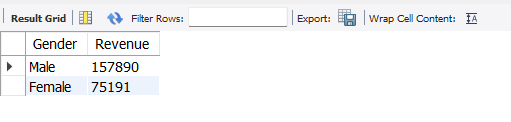

| # | Question |
|---|---|
| Q2 | Customers who used a discount but spent above average |

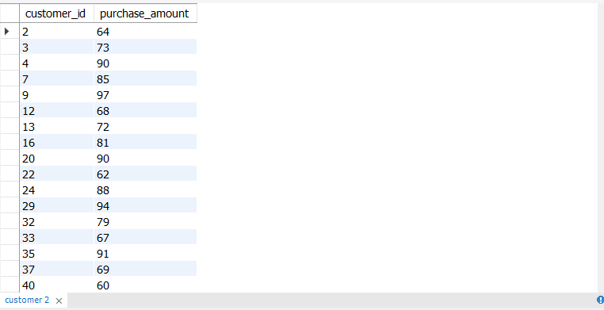

| # | Question |
|---|---|
| Q3 | Top 5 products by average review rating |

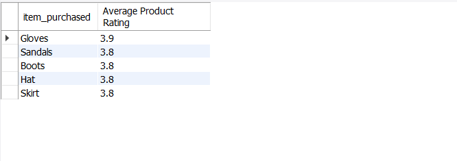

| # | Question |
|---|---|
| Q4 | Average purchase amount: Standard vs. Express shipping |

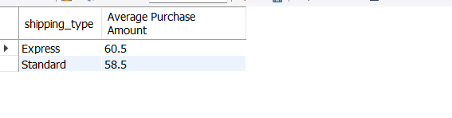

| # | Question |
|---|---|
| Q5 | Do subscribers spend more? Revenue & avg spend comparison |

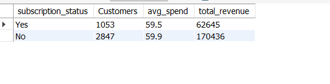

| # | Question |
|---|---|
| Q6 | Top 5 products with the highest discount usage rate |

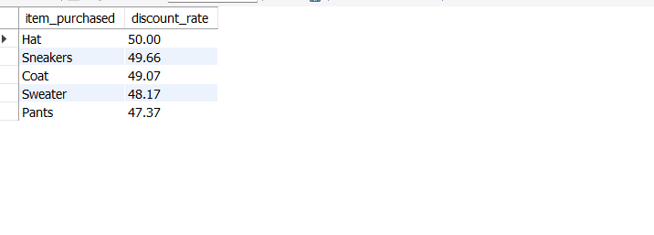

| # | Question |
|---|---|
| Q7 | Customer segmentation: New, Returning, Loyal |

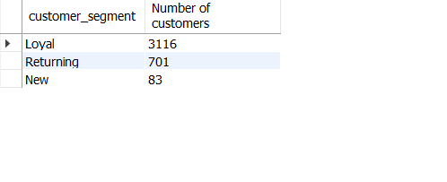

| # | Question |
|---|---|
| Q8 | Top 3 most purchased products per category (Window Function) |

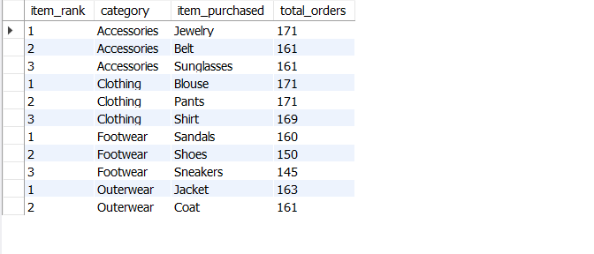

| # | Question |
|---|---|
| Q9 | Are repeat buyers (5+ purchases) more likely to subscribe? |

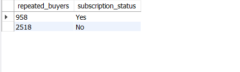

| # | Question |
|---|---|
| Q10 | Revenue contribution by age group |

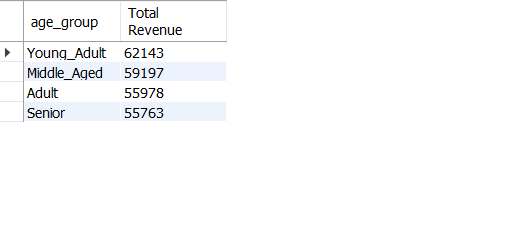

**Key SQL concepts demonstrated:** `GROUP BY`, `HAVING`, subqueries, `CASE WHEN`, `ROW_NUMBER() OVER(PARTITION BY ...)`, aggregate functions, and conditional aggregation.

---

## 📈 Power BI Dashboard

**File:** `dashboard/customer-behavior-showcase.pbix`

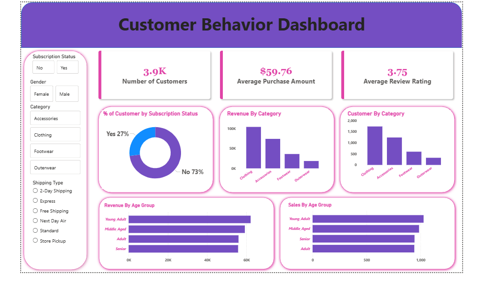

### Dashboard Highlights

The interactive dashboard features slicers for **Subscription Status**, **Gender**, **Category**, and **Shipping Type**, and includes:

- **KPI Cards** — Total Customers (3.9K), Average Purchase Amount ($59.76), Average Review Rating (3.75)
- **Donut Chart** — % of customers by subscription status (73% non-subscribed, 27% subscribed)
- **Bar Charts** — Revenue by Category (Clothing leads at ~$100K), Customers by Category (Clothing ~1,500+)
- **Horizontal Bar Charts** — Revenue & Sales count broken down by Age Group

### Key Insights from the Dashboard

- **Clothing** is the dominant category by both revenue (~$100K) and customer volume (~1,500+ customers)
- **Young Adults** contribute the highest revenue, followed closely by Middle Aged customers
- Only **27%** of customers are subscribed — a significant retention and upsell opportunity
- **Accessories** ranks second in both revenue and customer count, well ahead of Footwear and Outerwear

---

## 🛠️ Tools & Technologies

| Tool | Purpose |
|---|---|
| Python (Pandas, SQLAlchemy, PyMySQL) | Data Cleaning, Feature Engineering & DB Load |
| SQL (MySQL) | Business query answering |
| Power BI Desktop | Interactive dashboard |
| Jupyter Notebook | Data pipeline environment |
| GitHub | Version control & portfolio hosting |

---

## 🚀 How to Run

**Python Data Pipeline:**
```bash
pip install pandas sqlalchemy pymysql
jupyter notebook notebooks/customer_shopping_behavior_analysis.ipynb
```

**SQL:**  
Import `shopping_trends.csv` into your MySQL database as a table named `customer`, then run any query from `sql/queries.md`.

**Power BI:**  
Open `dashboard/customer-behavior-showcase.pbix` in Power BI Desktop (free download from Microsoft).


*Feel free to ⭐ this repo if you found it useful!*
